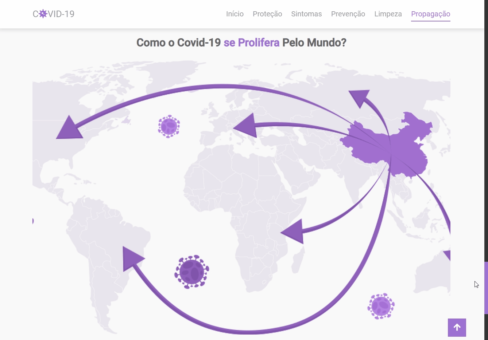
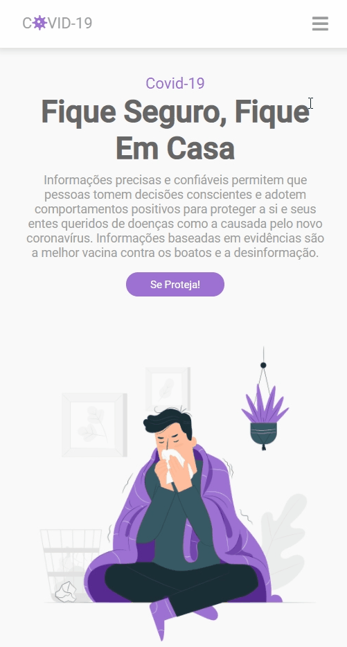
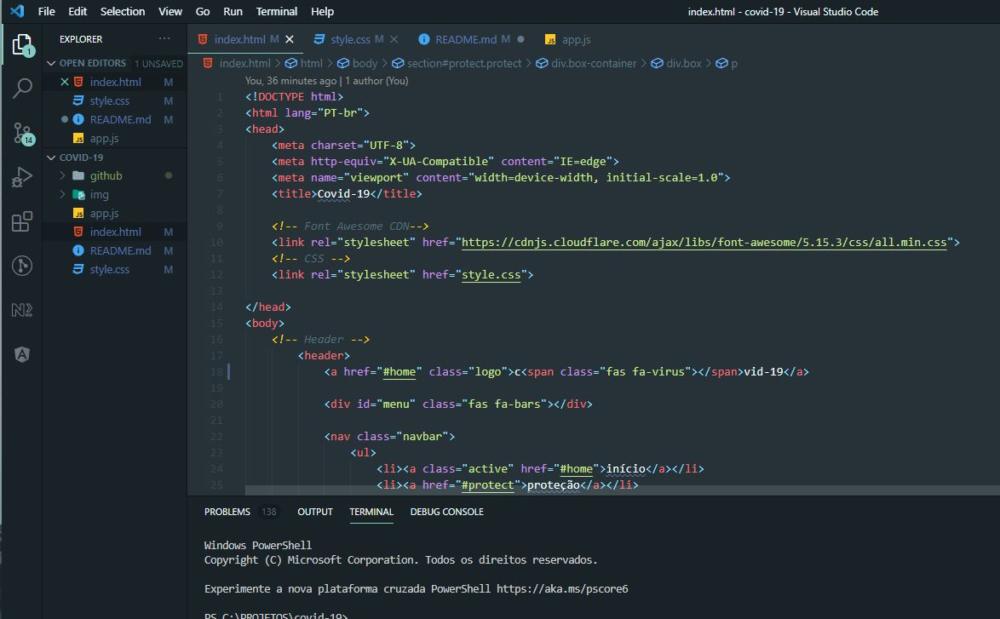

<h1 align="center">
    
</h1>

# COVID-19
Projeto com o objetivo de adquirir conhecimento em HTML, CSS e JavaScript. 
Por meio do tutorial do canal Mr. Web Designer, consegui aprender ainda mais desenvolvendo um site responsivo sobre a COVID-19. 
Ele possui o intuito de trazer informações importantes, dentre elas: sintomas, dicas de prevenção e higiene, bem como a forma pela qual o vírus é transmitido. 
Lembre-se: fique em casa!

Link do Tutorial: https://www.youtube.com/watch?v=sYguu9_ouvE

  
  

## Com o que trabalhamos? 
✅ HTML

✅ CSS

✅ JavaScript

✅ Jquery

## Características do Site

✔ Responsividade no Geral

✔ barra de navegação / cabeçalho com toggle e efeito de scroll.

✔ seção inicial responsiva usando flexbox.

✔ seção proteção responsiva usando flexbox.

✔ seção sintomas responsiva usando flexbox.

✔ seção prevenção responsiva usando flexbox.

✔ seção limpeza responsiva usando flexbox.

✔ seção propagação responsiva usando flexbox.

✔ seção rodapé (footer) responsiva usando flexbox.

## :camera: Veja:

### Desktop

### Mobile

### Código:

